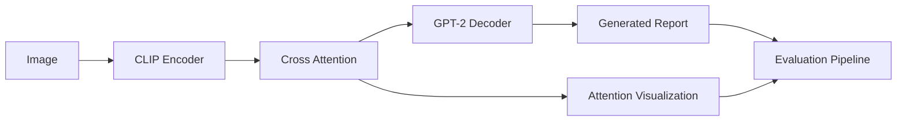

# Explainable Multimodal Medical AI for Radiology Report Generation

**CLIP + GPT-2 + Cross Attention + Explainable AI for chest X-ray report generation**

[](https://www.python.org/)
[](https://pytorch.org/)
[](https://www.docker.com/)
[](#license)
[](#project-overview)

## Project Overview

This project is a research-oriented multimodal medical AI system for automated radiology report generation from chest X-ray images. It combines a frozen CLIP vision encoder, a GPT-2 text decoder, and cross-attention fusion to translate visual findings into clinically structured narrative reports.

The system was designed around three goals:

- **Automated report generation** for chest X-ray interpretation.
- **Explainable AI support** through attention heatmaps and cross-attention overlays.
- **Evaluation-ready research workflow** with BLEU, CIDEr, and ROUGE-L metrics, failure analysis, and a manual qualitative rubric.

The repository includes training, inference, visualization, evaluation, Dockerization, and reporting artifacts so the project can be reviewed as a complete portfolio-grade medical AI system.

## Key Features

- CLIP vision encoder for patch-level image understanding.
- GPT-2 decoder for autoregressive radiology text generation.
- Cross-attention fusion between image patches and language tokens.
- Beam search inference with repetition control.
- Explainable AI attention visualization.
- Attention heatmaps and overlay generation for chest X-rays.
- BLEU / CIDEr / ROUGE-L evaluation pipeline.
- Failure analysis and qualitative rubric for manual assessment.
- Dockerized execution with CPU-safe defaults.
- Google Colab-friendly training workflow.

## Architecture Diagram



## Project Structure

| Path           | Purpose                                                      |
| -------------- | ------------------------------------------------------------ |
| `src/`         | Core training, inference, evaluation, and visualization code |
| `data/`        | Raw and processed dataset artifacts                          |
| `output/`      | Generated reports and visualization outputs                  |
| `results/`     | Evaluation metrics, demo artifacts, and attention scores     |
| `reports/`     | Failure analysis and qualitative rubric documents            |
| `checkpoints/` | Saved model weights and tokenizer artifacts                  |
| `tokenizer/`   | Tokenizer assets used by the multimodal pipeline             |

## Dataset

This project is organized around the **OpenI chest X-ray dataset**.

Recommended dataset preparation flow:

1. Download the OpenI chest X-ray dataset from the official OpenI resources.
2. Place raw images in `data/raw/images/`.
3. Place reports or annotations in `data/raw/reports/` and `data/raw/xml/`.
4. Run preprocessing to build train/validation/test splits under `data/processed/`.
5. Verify the processed CSV files before training or evaluation.

Expected data layout:

- `data/raw/` for unprocessed source material.
- `data/processed/` for CSV splits and tokenizer-ready artifacts.

## Installation

Clone the repository and set up a Python 3.10 environment:

```bash
git clone <your-repo-url>.git
cd radiology-report-generation-ai
python -m venv venv
```

Activate the environment and install dependencies:

```bash
# Windows PowerShell
.\venv\Scripts\Activate.ps1

# macOS / Linux
source venv/bin/activate

pip install --upgrade pip
pip install -r requirements.txt
```

## Environment Variables

Create a local `.env` file from `.env.example` and configure the following variables:

| Variable                 | Purpose                                                             |
| ------------------------ | ------------------------------------------------------------------- |
| `HF_HOME`                | Hugging Face cache directory                                        |
| `TOKENIZERS_PARALLELISM` | Disables tokenizer parallelism warnings in constrained environments |
| `PYTHONPATH`             | Ensures local `src/` imports resolve correctly                      |

Typical example:

```env
HF_HOME=./.cache/huggingface
TOKENIZERS_PARALLELISM=false
PYTHONPATH=.
```

## Docker

The repository includes a validated Docker setup for reproducible CPU-safe execution.

Verified commands:

```bash
docker-compose build
docker-compose up -d
docker-compose run app python -c "import torch; import transformers; print('Setup OK')"
```

Validation status: **passed successfully**.

## Training

Training is designed for lightweight GPU execution, including Google Colab T4 setups. The model keeps the CLIP and GPT-2 backbones frozen while fine-tuning cross-attention and the output layer for report generation.

Example training command:

```bash
python -m src.training.train \
	--epochs 4 \
	--batch-size 2 \
	--learning-rate 5e-5 \
	--output-dir checkpoints
```

Training notes:

- Frozen CLIP vision backbone for stable memory usage.
- Frozen GPT-2 backbone with selective fine-tuning.
- Cross-attention fine-tuning for image-to-text grounding.
- Lightweight GPU optimization for Colab T4 and similar setups.

## Inference

Generate a report from a single chest X-ray image using beam search decoding:

```bash
python src/predict.py --image_path data/test_image.jpg
```

The inference pipeline supports beam search report generation, repetition protection, and optional attention extraction for explainability.

## Visualization

Generate an attention overlay for explainable AI review:

```bash
python src/visualize.py \
	--image_path data/test_image.jpg \
	--output_path output/final_overlay.png
```

This creates attention heatmaps and cross-attention overlays that help inspect which image regions influenced the generated report.

## Evaluation

Evaluate generated reports using standard NLP generation metrics:

```bash
python src/evaluate.py \
	--test_file data/processed/test.csv \
	--output_dir results/
```

Outputs:

- `results/metrics.json`
- `results/evaluation_summary.txt`

Metrics included:

- BLEU-1 to BLEU-4
- CIDEr
- ROUGE-L

## Results

The current lightweight model achieves the following evaluation scores on the project’s current demo evaluation setup:

| Metric  |  Score |
| ------- | -----: |
| BLEU-1  | 0.5645 |
| BLEU-2  | 0.4150 |
| BLEU-3  | 0.3329 |
| BLEU-4  | 0.2814 |
| ROUGE-L | 0.5425 |
| CIDEr   | 1.7515 |

These results reflect the current research-stage configuration and should be interpreted alongside the failure analysis and rubric-based human review.

## Sample Outputs

The repository includes sample generated artifacts to demonstrate the end-to-end pipeline:

- `output/sample_1_report.txt`
- `output/sample_1_viz.png`
- `output/sample_2_report.txt`
- `output/sample_2_viz.png`

These files show how the system generates both the text report and the corresponding attention overlay for a given sample chest X-ray.

## Failure Analysis

Model limitations and common failure cases are documented in [reports/failure_analysis.md](reports/failure_analysis.md).

Key issues include:

- Anatomical confusion.
- Severity mismatch.
- Hallucinated findings.
- Repetitive or unstable generation.

This analysis reflects the current lightweight training regime and explains where the model remains clinically unreliable.

## Qualitative Rubric

Human evaluation guidelines are documented in [reports/rubric.md](reports/rubric.md).

The rubric provides a structured manual scoring framework for:

- Clinical Accuracy
- Completeness
- Fluency
- Anatomical Correctness
- Medical Consistency
- Hallucination Severity
- Report Coherence

## Future Improvements

Planned and recommended next steps:

- Replace GPT-2 with a stronger medical-domain decoder such as **BioGPT** or a comparable clinical language model.
- Scale training to larger datasets and more diverse radiology corpora.
- Add reinforcement learning or preference optimization for clinically preferred outputs.
- Improve decoding strategies for greater report stability and reduced repetition.
- Strengthen explainability with better attention supervision and evidence alignment.
- Expand to cloud deployment for reproducible research and scalable experimentation.
- Increase medical-domain adaptation through longer and more targeted fine-tuning.

## Technology Stack

| Component    | Used For                                |
| ------------ | --------------------------------------- |
| PyTorch      | Model training and inference            |
| Transformers | CLIP and GPT-2 integration              |
| OpenCV       | Heatmap resizing and overlay generation |
| Matplotlib   | Visualization rendering                 |
| NLTK         | BLEU computation and text processing    |
| ROUGE        | ROUGE-L evaluation                      |
| CLIP         | Vision encoding                         |
| GPT-2        | Report generation                       |
| Docker       | Reproducible containerized execution    |

## Contributing

Contributions are welcome, especially in the following areas:

- Improving clinical grounding and report fidelity.
- Adding stronger evaluation and interpretability methods.
- Expanding dataset coverage and preprocessing robustness.
- Enhancing Docker, Colab, and deployment workflows.

Contribution guidelines:

1. Fork the repository and create a feature branch.
2. Keep changes focused and well documented.
3. Run the relevant training, inference, evaluation, or visualization checks before submitting.
4. Update documentation when behavior or commands change.
5. Prefer small, reviewable pull requests with clear rationale.

## License

This project is provided under an MIT-style placeholder license.

---

If you are using this repository for research, evaluation, or portfolio presentation, the recommended review flow is:

1. Read the architecture and pipeline sections.
2. Inspect the sample outputs.
3. Review the failure analysis and rubric.
4. Run inference, visualization, and evaluation locally or in Docker.
